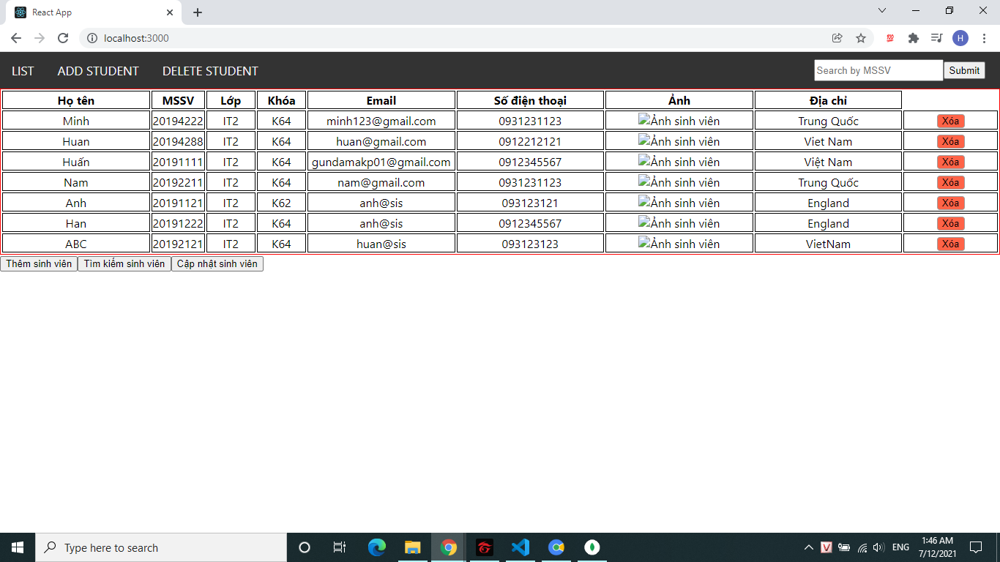

# Xây dựng web quản lý sinh viên

## Chạy Project

- Run server:
  
  ```cmake
  cd server
  npm install
  npm start
  ```

- Run ui:
  
  ```cmake
  cd app
  npm install
  npm start
  ```

## Một số hình ảnh của web

### Danh sách sinh viên



### Thêm sinh viên


### Cập nhật thông tin sinh viên


### Xóa thông tin sinh viên


### Tim kiem thông tin sinh viên


